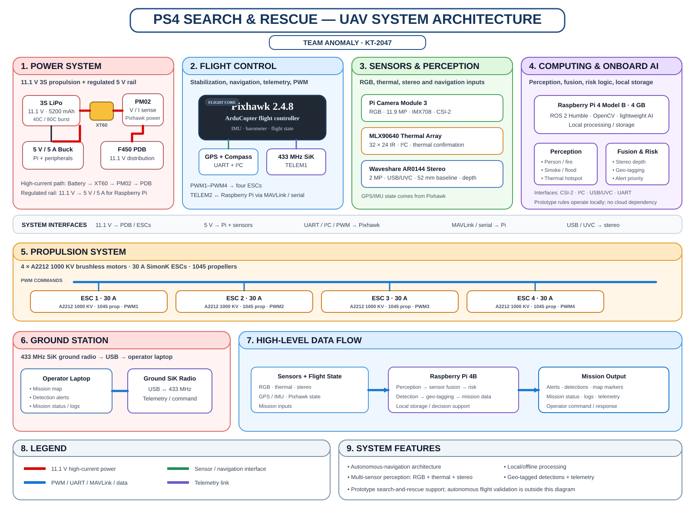

# PS4 Search & Rescue Command Center

**KAYA Buildathon 2026 · PS4 — AI-Powered Autonomous Drone for Search-and-Rescue**  
**Team:** ANOMALY · **Team ID:** KT-2047

## Project status

This repository contains the **PS4 Search & Rescue Command Center**, its deterministic mission simulation, and the engineering documentation for the proposed UAV platform.

> **Important:** The dashboard is a simulation. The physical UAV, live Pixhawk/MAVLink link, ROS 2 companion pipeline, sensor hardware and autonomous flight have not been integrated or flight-validated in this repository.

| Area | Status |
|---|---|
| Command-center web application | Implemented |
| Mission simulation | Implemented |
| Detection / fusion / risk workflow | Implemented as deterministic simulation logic |
| Physical UAV integration | Not integrated |
| Pixhawk / MAVLink live telemetry | Architecture defined; not connected |
| ROS 2 companion pipeline | Architecture defined; not connected |
| Physical sensor integration | Not validated |
| Autonomous flight | Not validated |

## Engineering package

The engineering artifacts are intentionally separated by purpose. The controlled PDF files used for the KAYA form are the submission attachments; the repository contains GitHub-readable engineering references for the same baseline:

| Artifact | Purpose |
|---|---|
| [Final BOM reference](docs/submission/BOM_Final.md) | Procurement baseline, specifications, quantities and cost |
| [Circuit Schematic reference](docs/submission/Circuit_Schematic.md) | Electrical power, control and data interfaces |
| [System Architecture](docs/submission/System_Architecture.svg) | System-level hardware, data-flow and functional architecture |
| [System Review reference](docs/submission/System_Review_Engineering_Document.md) | Detailed engineering explanation, interfaces, validation and limitations |
| [Engineering Package Guide](docs/ENGINEERING_PACKAGE.md) | Document hierarchy and submission guidance |

The **BOM** is the procurement source of truth, the **circuit schematic** is the electrical-interface source of truth, and the **system architecture** is the system-level functional source of truth. The **System Review** explains how these artifacts fit together.

## System architecture



### Physical data path

```
3S LiPo
  │
  ├── Pixhawk power module ──> Pixhawk 2.4.8
  │                              ├── PWM 1–4 ──> 30 A ESCs ──> A2212 motors
  │                              ├── GPS / compass
  │                              ├── TELEM1 ──> 433 MHz SiK telemetry ──> ground laptop
  │                              └── TELEM2 / MAVLink ──> Raspberry Pi 4B
  │
  └── 5 V / 5 A buck ──> Raspberry Pi 4B + selected peripherals

RGB Camera 3 ───────┐
MLX90640 ───────────┼──> Raspberry Pi 4B ──> perception / fusion / risk / geotagging
AR0144 Stereo ──────┘                                  │
                                                       └──> command center
```

## Hardware baseline

- F450/Q450 450 mm frame with integrated PCB/power distribution
- 4 × A2212 1000 KV BLDC + matched 30 A SimonK ESCs + 1045 propellers
- Pixhawk 2.4.8 + GPS/compass + power module
- Raspberry Pi 4 Model B, 4 GB
- Samsung EVO Plus 128 GB microSD
- Raspberry Pi Camera Module 3
- MLX90640 32 × 24 thermal module
- Waveshare AR0144 synchronized stereo camera
- 3S 11.1 V 5200 mAh 40C/80C LiPo
- 5 V / 5 A synchronous buck converter
- 433 MHz, 100 mW-class SiK telemetry pair
- F450/F550 landing skid
- Wiring and integration hardware
- B3 2S/3S LiPo charger as separate test-support procurement

The final procurement list is **₹44,636.73** against a **₹46,000** ceiling, leaving **₹1,363.27** headroom. The documented stress case is **₹45,152.97**. The charger is support procurement rather than airborne payload.

## Capability coverage

The Buildathon capability position deliberately separates architecture from evidence:

- Autonomous navigation: architecture defined; flight validation pending.
- On-device AI: architecture defined; physical inference not validated.
- Multi-sensor fusion: deterministic simulation implemented; physical integration pending.
- Hazard classification: simulation logic implemented; field/model validation pending.
- Geo-tagged mapping: simulation workflow implemented.
- Emergency alerting: simulation workflow implemented.
- Offline resilience: designed for local/offline aircraft-side processing.
- Command center: implemented as deterministic simulation.

## Software architecture

```
Pixhawk 2.4.8
      │
MAVLink / Serial
      │
      ▼
Raspberry Pi 4B · 4 GB
      │
ROS 2 Humble architecture
      ├── RGB perception
      ├── MLX90640 thermal analysis
      ├── AR0144 stereo depth / SLAM
      ├── sensor fusion
      └── edge risk engine
      │
      ▼
Mission data adapter
      │
      ▼
Next.js command center
```

The deployed dashboard currently uses `SimulationDataProvider`. It does not consume live Pixhawk data.

## Mission simulation

The demonstration sequence covers initialization, takeoff, grid search, visual detection, thermal confirmation, stereo range estimation, geotagging, risk assignment, alert creation, continued search and return-to-launch.

Prototype risk rules are demonstration logic and are not emergency-service standards.

## Repository structure

```
.
├── docs/
│   ├── ENGINEERING_PACKAGE.md
│   └── submission/
│       ├── BOM_Final.pdf
│       ├── Circuit_Schematic.pdf
│       ├── System_Architecture.png
│       └── System_Review_Engineering_Document.pdf
├── hardware/
│   └── SYSTEM_SPECIFICATIONS.md
├── software/
│   └── ROS2_PIPELINE.md
├── src/
│   ├── adapters/
│   ├── app/
│   ├── components/
│   ├── config/
│   ├── context/
│   ├── lib/
│   ├── simulation/
│   └── types/
├── package.json
└── README.md
```

## Local development

```bash
git clone https://github.com/nafisdevtale/kaya-ps4-search-and-rescue.git
cd kaya-ps4-search-and-rescue
npm ci
npm run dev
```

Open `http://localhost:3000`.

Production build:

```bash
npm run build
npm run start
```

The current simulation build requires no API keys or application-side secrets.

**Team ANOMALY · KT-2047 · KAYA Buildathon 2026**
